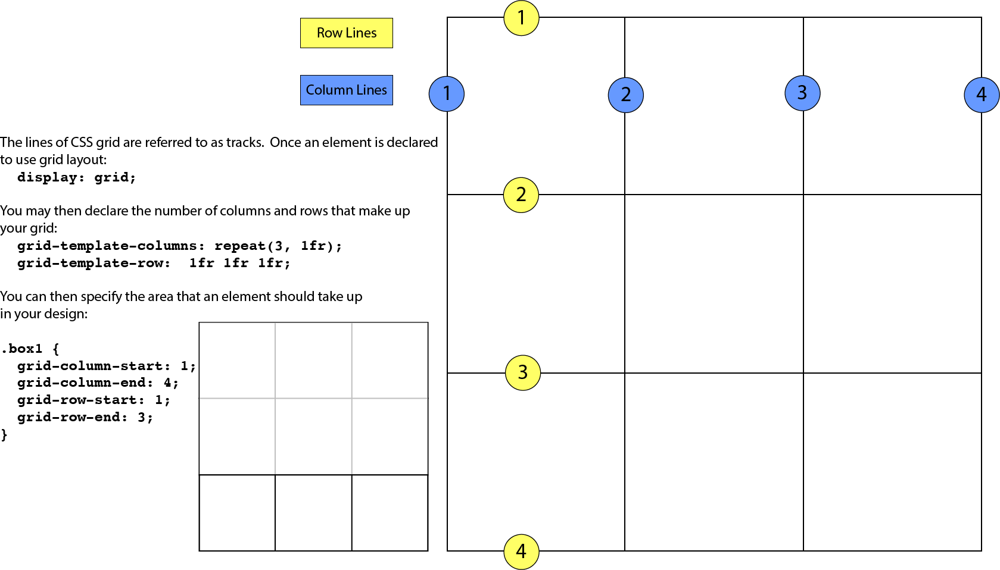
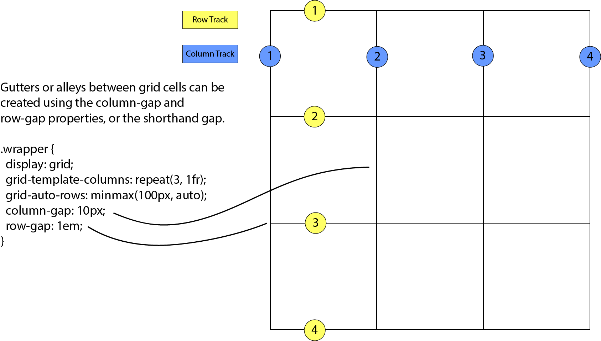

## CSS Refresher

CSS stands for “Cascading Style Sheets”. It applies design to your HTML elements, in the form:

`selector {
property: value;
}`

You can either import it from a `.css` file using an HTML tag, like so:

`<link rel=’stylesheet’ href=’styles.css’>`

Or just declare inline styles in your HTML:

``

You can also just style an individual element, but this tends to be a bad idea, because individual element styles take precedence over inline or imported styles:

`
This is a bad idea
`

### Selectors

A better idea is to use a selector, which in HTML takes the form of an ID, element type, or a class:

A type selector, as in the example above, is just an element type:

`p {
  color: red;
}`

An ID selector, denoted by the `#`, is only used for one element on the page - save these for if you have a **specific** element that really needs a unique style.

`#header {
  font-size: 240px;
}`

Classes, on the other hand, are used for multiple elements that have the same style. Let’s say we want a bunch of divs to have the same background color:

`.blue-div {
  background-color: blue;
}`

There are also more complex selectors we can use:

The descendant selector:

This selector allows you to apply styles to elements contained within other elements, e.g. if we wanted every `
` within a `
` to have red text:

`div p {
  color: red;
}`

The child selector:

Similar to the descendant selector, but **only** applies to an element that is a direct child of the parent element. So

`div > span {
  color: red;
}`

Would apply to:

`
I’m red!
`

But not:

`

I’m not red :(

`

Scoping:

We can also narrow the scope of a selector by specifying the element type it should apply to:

`div.main {
  margin-left: 30%;
}`

Would apply to `

 but not `

## The Element Box

## Positioning

- Static: the default positioning scheme
- Relative: Moves the box relative to its original position in the flow of the document
- Absolute: Elements are removed from document flow entirely and are positioned relative to a containing element.
- Fixed: Element stays in one position in the window even when the document is scrolling.
- Sticky: Similar to fixed, but remains in the same position while scrolling

## Layouts, Grid, Flexbox

### Grid

A CSS grid layout is a common way to lay out page content. You use the display property to turn an element into a grid container and the element’s children automatically become grid items.

Set up columns and rows for the grid - either explicitly or showing how rows and columns are created on the fly. Assign each grid item to an area on the grid.

**Reference***: [Getting Started With CSS Grid](https://css-tricks.com/getting-started-css-grid/)

### Flexbox

Flexbox is similar to grid, but is designed for layout in one dimension: either a row or a column, not both.

Key flexbox properties:

`display: flex;` : makes an element into a flex container
`flex-direction: column` OR `row`: direction the container will stack its items.
`flex-wrap: nowrap` OR `wrap`: default is nowrap, wrap allows items to “wrap”: create a new row
Horizontal alignmnet: `justify-content: space-between;`, or alternately `space-around` or `center`

Vertical alignment: `align-items: flex-start`(top), `flex-end`(bottom), `center`(default)

**Reference***:(A Complete Guide To Flexbox)[https://css-tricks.com/snippets/css/a-guide-to-flexbox/]
